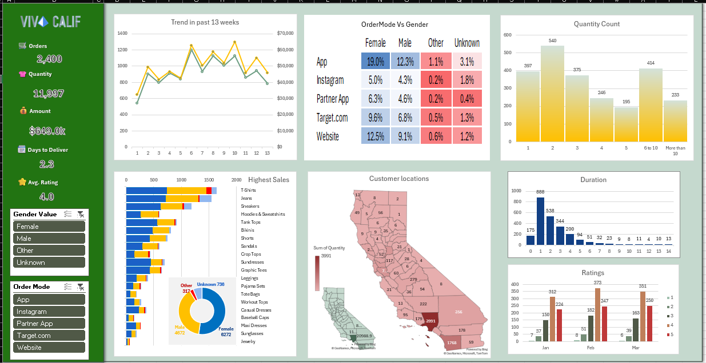

# 📊 Sales Analytics Dashboard

An interactive sales analytics dashboard built using **Microsoft Excel** to analyze sales performance, customer behavior, product performance, order preferences, delivery duration, customer locations, and customer satisfaction.

The dashboard brings multiple business questions and key performance indicators (KPIs) together in a single interactive view using Excel-based data analysis and visualization techniques.

---

## 📌 Project Overview

This project focuses on transforming sales data into a meaningful and easy-to-understand dashboard.

The dashboard was designed around a set of key business questions and KPIs to help understand:

- Overall sales performance
- Customer purchasing behavior
- Preferred order modes
- Product popularity
- Customer demographics
- Customer geographic distribution
- Order delivery duration
- Customer satisfaction

Interactive filters allow the dashboard to be explored from different perspectives.

---

## 🎯 Business Questions

The dashboard was created to answer the following questions:

1. What are the key sales performance indicators?
2. What is the sales trend over the last 13 weeks?
3. Which order modes do customers prefer?
4. How much quantity do customers purchase?
5. Which products are the most popular?
6. What is the overall gender distribution?
7. Where are the customers located?
8. How long does it take to deliver orders?
9. How satisfied are the customers?

---

## 📈 Key Performance Indicators

The dashboard includes the following KPIs:

| KPI | Description |
|---|---|
| 🛒 Total Orders | Total number of orders |
| 📦 Total Quantity | Total quantity of products ordered |
| 💰 Total Amount | Overall sales amount |
| ⭐ Average Rating | Average customer rating |
| 🚚 Average Days to Deliver | Average delivery time |

---

## 📊 Dashboard Features

### 📈 13-Week Sales Trend
Shows the sales/order trend across the last 13 weeks to identify changes and patterns over time.

### 🛍️ Order Mode Analysis
Analyzes how customers place orders through different channels such as:

- App
- Instagram
- Partner App
- Target.com
- Website

The analysis is further compared across gender categories.

### 📦 Quantity Analysis
Shows the distribution of orders based on the quantity purchased.

### 👕 Product Performance
Highlights the products generating the highest sales and helps identify popular products.

### 👥 Gender Analysis
Provides an overview of the customer gender distribution.

### 🗺️ Customer Location Analysis
Visualizes customer distribution geographically to understand where customers are located.

### 🚚 Delivery Duration Analysis
Shows how long orders take to be delivered and helps identify the distribution of delivery times.

### ⭐ Customer Rating Analysis
Analyzes customer ratings across different months to understand customer satisfaction.

---

## 🎛️ Interactive Filters

The dashboard includes interactive Excel slicers that allow users to filter the analysis based on:

### Gender
- Female
- Male
- Other
- Unknown

### Order Mode
- App
- Instagram
- Partner App
- Target.com
- Website

The dashboard visuals update based on the selected filters.

---

## 🖼️ Dashboard Preview



---

## 🛠️ Tools & Technologies

- **Microsoft Excel**
- Pivot Tables
- Pivot Charts
- Excel Slicers
- Excel Formulas
- Data Analysis
- Data Visualization
- Map Visualization
- Dashboard Design

---

## 📂 Project Structure

```text
excel-sales-dashboard/
│
├── README.md
│
├── Dashboard/
│   └── Sales_Dashboard.xlsx
│
├── Preview/
    └── dashboard.png
